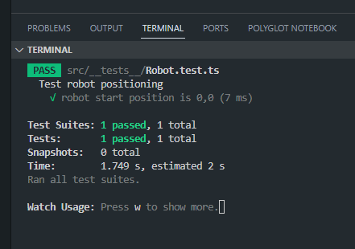
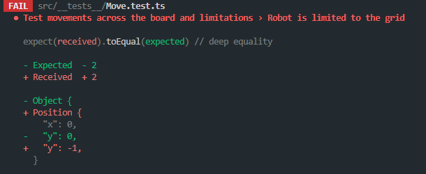

## Robot Challenge

`Company: NetConsult`

`Language: TypeScript`

`Start time: 12:44 - 2024-03-12`

- Develop an api that moves a robot around on a grid (flat surface with defined size)
- Grid position (0, 0) should be the upper left corner
- You are given the initial starting point (x,y) of a robot and the direction (N,S,E,W) it is facing.
- The robot receives an array of commands.
- Implement commands that move the robot forward/backward (f,b).
- Implement commands that turn the robot left/right (l,r).
- "If a given sequence of commands encounters an obstacle or is out of bounds, the robot should stop and report the obstacle. For example if it hits an obstacle or wall it should stop immediately without executing any more commands.
- Implement detection if the new position is inside the bounds before moving to the new position.
- Implement obstacle detection before each move to a new square.

Test Cases

- The robot is on a 100×100 grid at location (0, 0) and facing SOUTH. The robot is given the commands "fflff" and should end up at (2, 2)
- The robot is on a 50×50 grid at location (1, 1) and facing NORTH. The robot is given the commands "fflff" and should end up at (1, 0)
- The robot is on a 100×100 grid at location (50, 50) and facing NORTH. The robot is given the commands "fflffrbb" but there is an obstacle at (48, 50) and should end up at (48, 49)

Bonus

- Ability to implement different rule sets for flat surface or a globe where you warp when you get out of bounds

Hints: use multiple classes, TDD and a healthy approach to VCS

---

Created a git repository and added my first init.
Created my .gitignore with some basic values, which I will add to if needed.

Map structure

```
project-root/
|-- api/
|   |-- src/
|   |   |-- classes/
|   |   |   |-- Board.ts
|   |   |   |-- Position.ts
|   |   |   |-- Robot.ts
|   |   |-- __tests__/
|   |   |   |-- Robot.test.ts
|-- build/
|-- node_modules/
|-- tsconfig.json
|-- package.json
```

```
npm init -y
npm i jest @types/jest ts-node typescript ts-jest
tsc --init
```

I created jest.config.ts and tslint.json with configuration.

I created my first test to check the starting position for the robot, making sure it is correct at x: 0 and y: 0.
I built the test which failed, I then created the class to set the values for the robot, and the test passes.



I had already written some code to make the robot move to the left, right, up, and down, but for TDD purposes, I removed that code and ran the tests first. Which, of course, failed. I added the code again, and this time the test passed.


---

Next, I want to test the direction of the Robot. I tested if the robot is facing north, as expected the test failed, since I have no code for this.

```
describe("Test robot directions N, W, E, S", () => {
  test("Robot direction is North", () => {
    const direction = new Direction(0, 0, EnumeratedDirection.north);
    const currentDirection = direction.getCurrentPosition();
    expect(currentDirection).toEqual(EnumeratedDirection.north);
  });
});
```

So now I want to test the Board, to see if I can set the grid to the expected size. First, I want to test that the grid size is 100x100.
The test fails, since I have no code built for this.
I create the board where I want to set the starting position and size of the grid. My board will take in 4 values, starting position x, y, grid-width, and grid-height.
Once this is done, the test runs without error.

```
describe("Test grid pattern and positioning", () => {
  test("Grid pattern is 100x100", () => {
    const board = new Board(0, 0, 100, 100);
    expect(board.getWidth()).toEqual(100);
    expect(board.getHeight()).toEqual(100);
  });
});
```

After I ran the test to check for the right turn, it seemed to pass even though I hadn't created that method yet. So I created an error to occur if the command was not valid. After this, the test failed, of course. I then created the method and added the command to the allowed commands.


So now I want to test if my robot stays within the grid when moving out of bounds.
This happens,



I am testing that the robot will land on the 0,0 position when giving commands: ["f", "f", "b", "b", "b"] but it instead goes out of bounds.
I inverted the grid to increase going downwards as well with incrementing steps instead of decrementing.

Updated map structure to create API

```
project-root/
|-- api/
|   |-- src/
|   |   |-- classes/
|   |   |-- configuration/
|   |   |-- controller/
|   |   |-- middlewares/
|   |   |-- routes
|   |   |   |-- Board.ts
|   |   |   |-- Position.ts
|   |   |   |-- Robot.ts
|   |   |-- __tests__/
|   |   |   |-- Robot.test.ts
|   |   |-- utils
|   |   |   |-- interfaces
|   |   |   |-- Logger.ts
|-- build/
|-- node_modules/
|-- tsconfig.json
|-- package.json
```

I installed necessary dependencies and started to create my server.ts
Added some errorhandling middleware as well as a Logger to output to the console.
